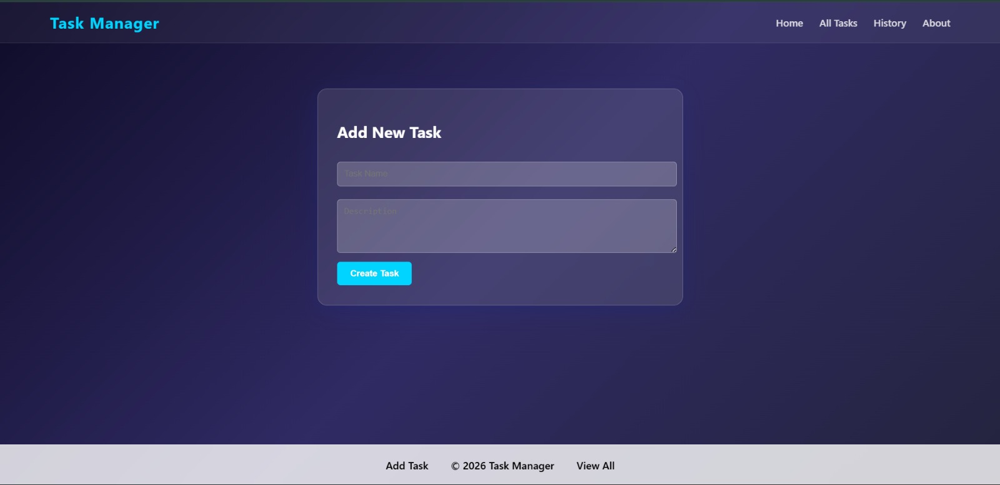
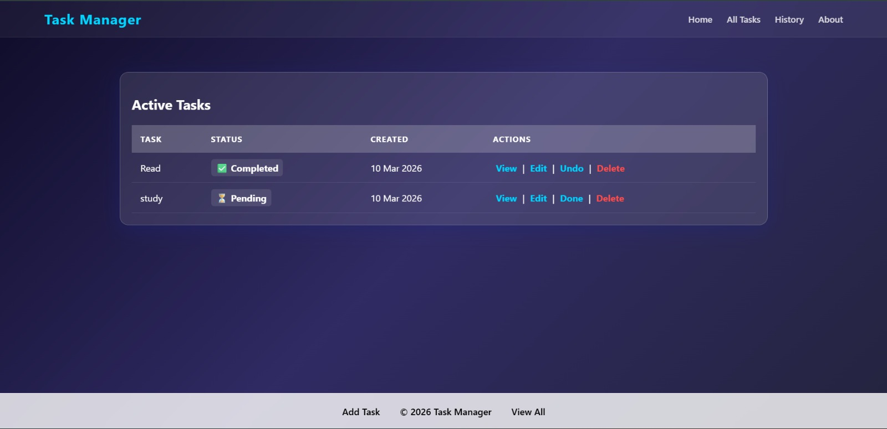
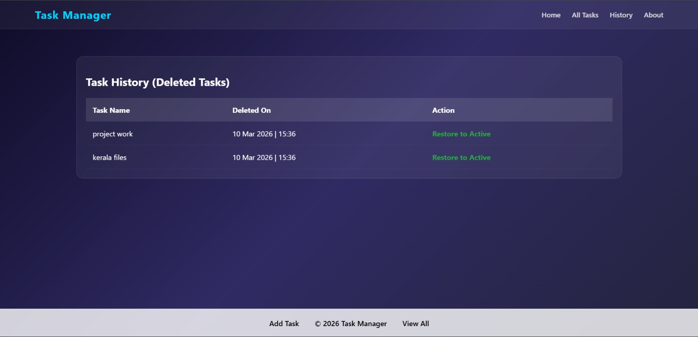
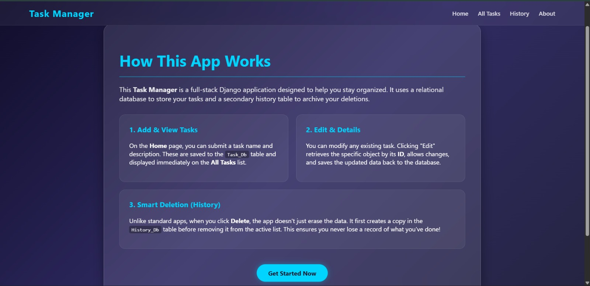

# Django Todo Application

A task management web application built using Django. It allows users to create tasks, toggle completion status, delete tasks, and restore deleted tasks from history.

## Screenshots

### Home Page

### Tasks Page

### History Page

### About Page

## Features
- Create tasks with descriptions
- Toggle task completion status
- Delete tasks with history tracking
- Restore deleted tasks
- Clean UI with organized templates and static files

## Tech Stack
- Python
- Django
- SQLite
- HTML
- CSS

## Setup Instructions

1. Clone the repository
2. Install dependencies

pip install -r requirements.txt

3. Run migrations

python manage.py migrate

4. Start the server

python manage.py runserver

todo_app
│
├── app
├── static
├── templates
├── todo_app
├── screenshots
│   ├── about.jpeg
│   ├── history.jpeg
│   ├── home.jpeg
│   └── tasks.jpeg
│
├── manage.py
├── requirements.txt
├── README.md
└── .gitignore